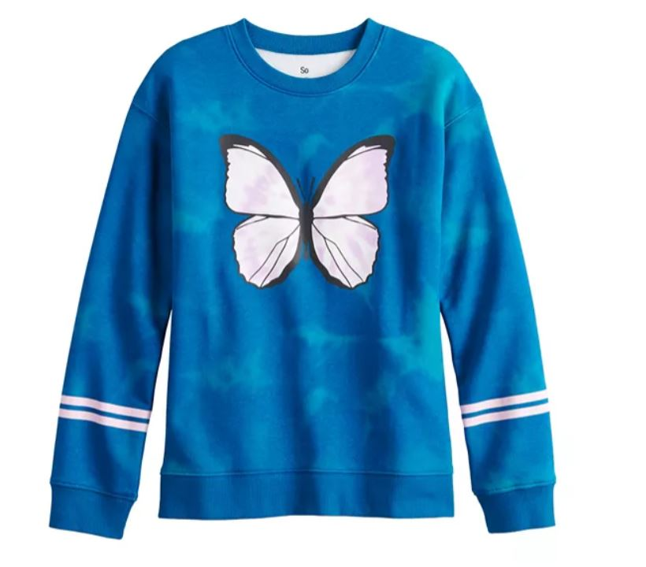
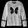
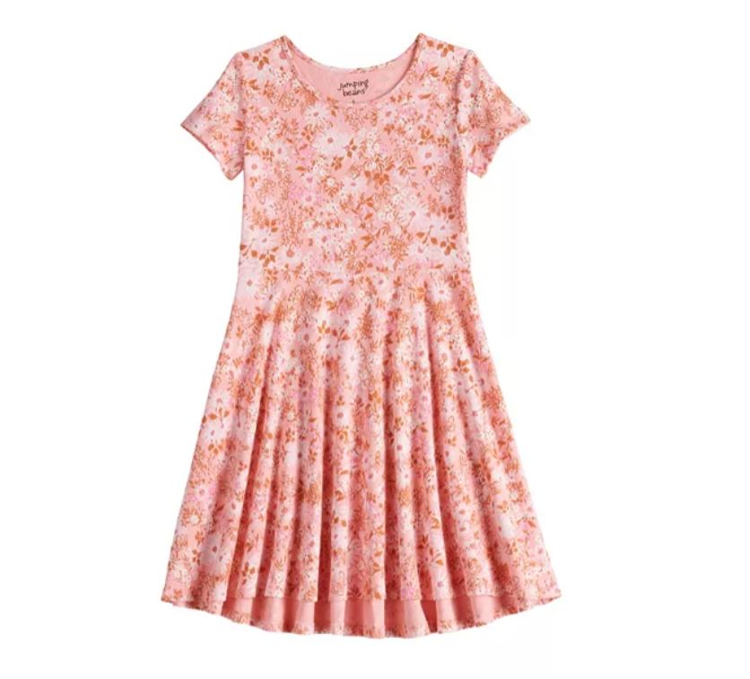
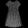
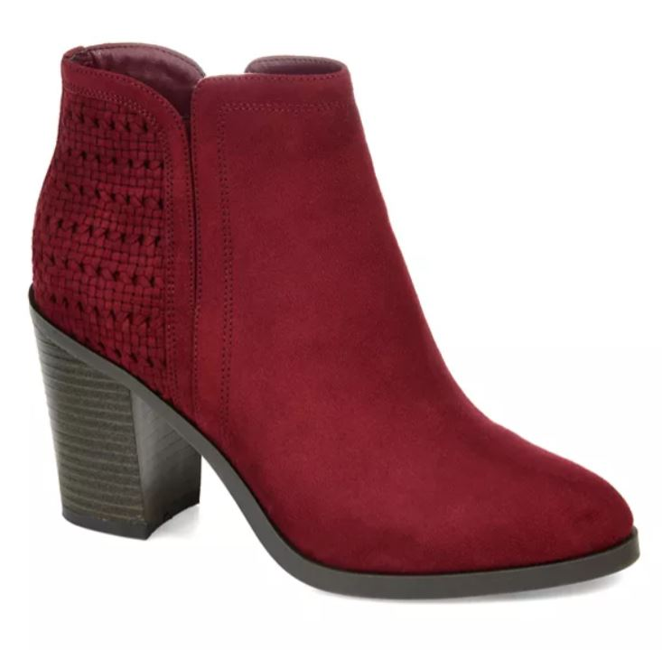
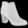
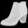

# Lab 11 - Tensorflow

## Checkpoint 1: Verify Your TensorFlow

After running the given code segment, this was the pop-up window I received.


## Checkpoint 2: Run a TensorFlow classification

After completing the fashion classification example, I then modified the specified block of code to produce information for images 9000-9014 rather than images 0-14. Here is the screenshot of that plot


## Checkpoint 3: Curate some data

### Image 1 - Pullover

Original image:



Greyscale, inverted, 28x28 image:



Classification results:


```
[[1.2203583e-02 1.7796726e-06 9.2843950e-01 1.0356769e-06 3.1591386e-02
  9.0163560e-08 2.7739819e-02 3.0974385e-09 2.2757335e-05 5.8823471e-09]]
2
Pullover
```

### Image 2 - Dress

Original image:



Greyscale, inverted, 28x28 image:



Classification results:


```
[[1.0356742e-01 5.5765599e-04 5.8868062e-03 6.6605061e-01 2.3919216e-03
  9.1357681e-05 2.1970439e-01 4.6146313e-05 1.6802151e-03 2.3418530e-05]]
3
Dress
```

### Image 3 - Ankle Boot

Original image:



Greyscale, inverted, 28x28 image:



Classification results:


```
[[8.1032736e-04 8.4845806e-06 2.7008257e-03 1.1380437e-04 4.4843042e-03
  2.2340153e-10 8.4797156e-01 5.8386194e-09 1.4391072e-01 1.3334572e-10]]
6
Shirt
```

It really bothered me that the model couldn't identify this ankle boot, so just for fun I flipped the image and tested it.



These were the classification results:


```
[[1.6898569e-11 9.8822198e-13 2.8880859e-14 3.1399057e-11 7.9767981e-15
  2.3984883e-04 1.3607881e-12 3.5611136e-04 1.7198776e-10 9.9940407e-01]]
9
Ankle boot
```

So it looks like the data is only trained on shoes/boots with the toe facing left!
